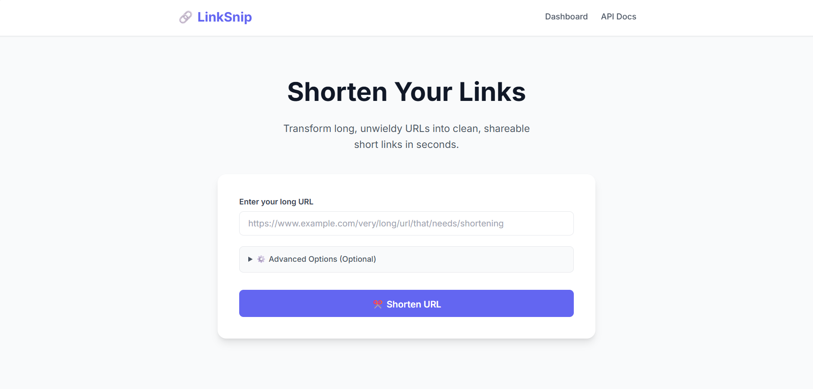
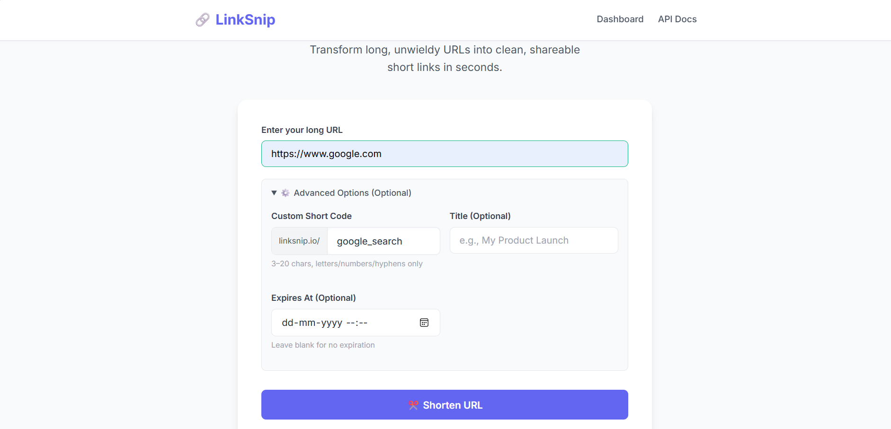
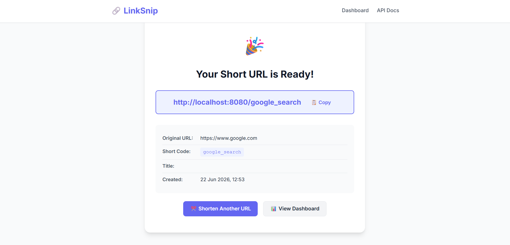
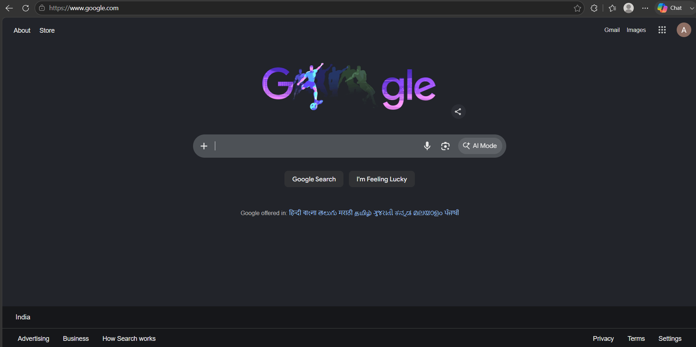
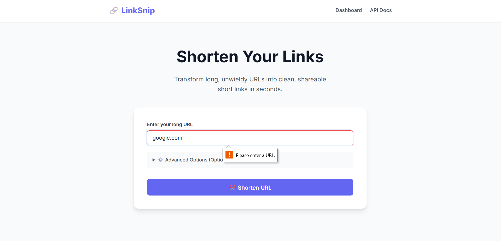

# 🔗 LinkSnip — URL Shortener

A full-stack URL Shortener web application built using **Java 21, Spring Boot, Spring Data JPA, MySQL, and Thymeleaf.

LinkSnip is a full-stack URL shortening platform built using Java 21, Spring Boot, Spring Data JPA, MySQL, and Thymeleaf. The application supports custom short codes, automatic URL generation, input validation, persistent storage, and browser-based redirection through a clean web interface.

---

## Repository

https://github.com/AsimYash/url-shortener

## 🚀 Features

- 🔗 Create short URLs from long URLs
- 🎯 Custom short codes
- ⚡ Automatic short code generation
- 🔄 Redirect users to the original URL
- ✅ URL validation
- 🛡️ Exception handling
- 💾 Persistent storage using MySQL
- 🌐 Web-based user interface

---

## 🛠️ Tech Stack

### Backend
- Java 21
- Spring Boot 3
- Spring MVC
- Spring Data JPA
- Hibernate

### Database
- MySQL

### Frontend
- Thymeleaf
- HTML
- CSS
- JavaScript

### Build Tool
- Maven

---

## 📂 Project Structure


url-shortener/
│
├── src/
│ ├── main/
│ │ ├── java/com/urlshortener/
│ │ │
│ │ ├── controller/
│ │ │ ├── UrlShortenerController.java
│ │ │ └── RedirectController.java
│ │ │
│ │ ├── service/
│ │ │ └── UrlShortenerService.java
│ │ │
│ │ ├── repository/
│ │ │ └── UrlMappingRepository.java
│ │ │
│ │ ├── entity/
│ │ │ └── UrlMapping.java
│ │ │
│ │ └── dto/
│ │ └── CreateUrlRequest.java
│ │
│ └── resources/
│ ├── templates/
│ ├── static/
│ └── application.properties
│
├── pom.xml
└── README.md


---

# ⚙️ Running Locally

## Prerequisites

Install:

- Java 21+
- Maven
- MySQL

Check versions:

```bash
java -version

mvn -version
1. Clone Repository
git clone https://github.com/AsimYash/url-shortener.git

cd url-shortener
2. Create MySQL Database

Open MySQL:

CREATE DATABASE urlshortener;
3. Configure Database

Open:

src/main/resources/application.properties

Update:

spring.datasource.url=jdbc:mysql://localhost:3306/urlshortener
spring.datasource.username=root
spring.datasource.password=YOUR_PASSWORD

spring.jpa.hibernate.ddl-auto=update
spring.jpa.show-sql=true

Replace:

YOUR_PASSWORD

with your MySQL password.

4. Run Application

Using Maven:

mvn spring-boot:run

OR

Build:

mvn clean package

Run:

java -jar target/*.jar
🌐 Open Application

Open browser:

http://localhost:8080
🧪 Testing
Create Short URL

Example:

Long URL:

https://www.google.com

Custom code:

google

Generated link:

http://localhost:8080/google

Opening the short link redirects to:

https://www.google.com
Validation Example

Invalid input:

google.com

Result:

URL must start with http:// or https://
📸 Screenshots

(Add screenshots after running the project)

## Screenshots

### Home Page


### URL Creation


### Successful Short URL


### Redirect Working


### Validation Error


🔮 Future Improvements
User authentication
JWT security
QR code generation
Click analytics dashboard
Rate limiting
Custom domains
Docker deployment
Cloud hosting
📌 API Endpoints
Create Short URL
POST /api/urls

Example request:

{
  "originalUrl": "https://example.com",
  "customCode": "example"
}
Redirect
GET /{shortCode}

Example:

GET /example

Redirects to the original URL.

👨‍💻 Author

ASIM YASH

GitHub: https://github.com/AsimYash
