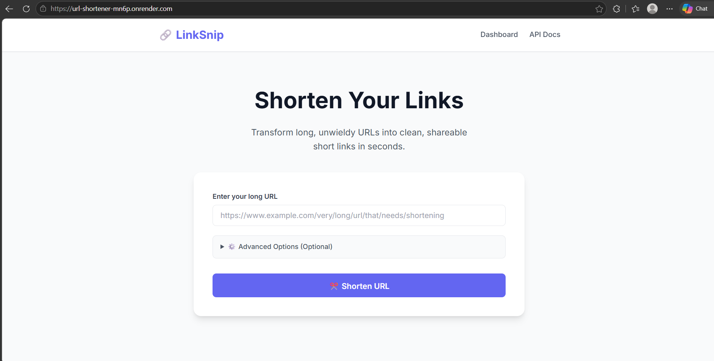
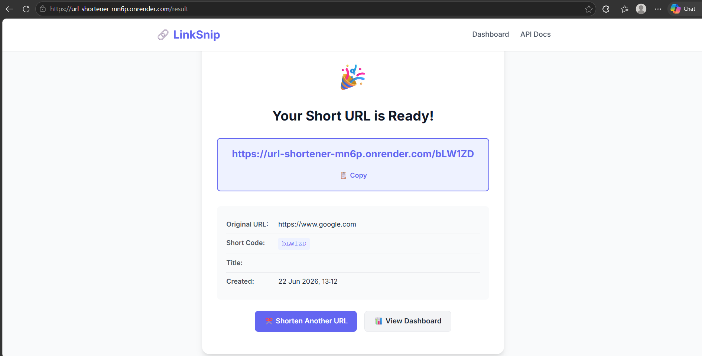
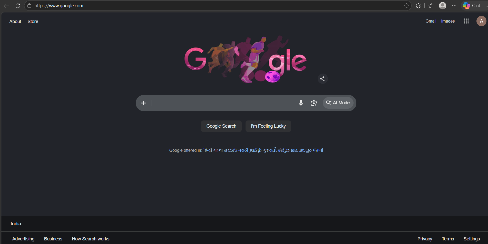
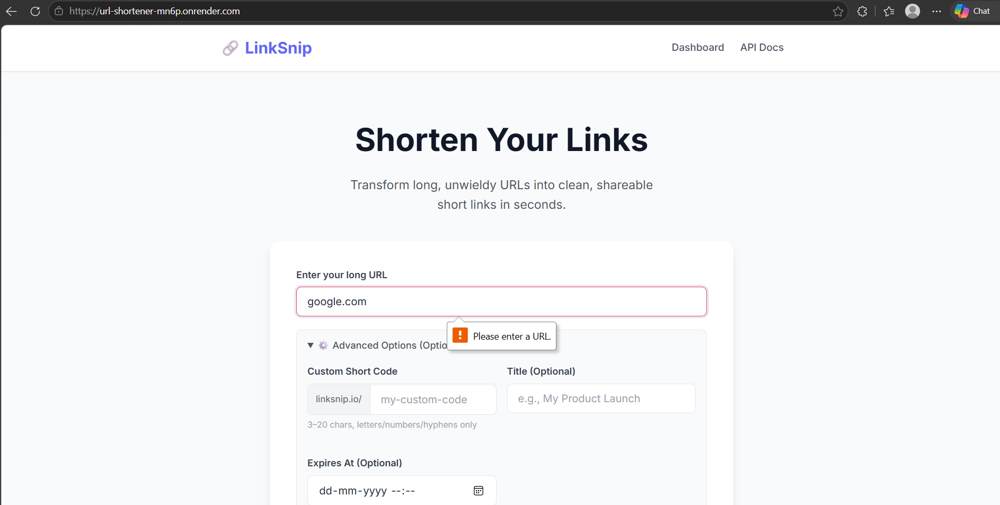

# 🔗 LinkSnip — URL Shortener


A full-stack URL Shortener application built using **Java 21, Spring Boot, Spring Data JPA, MySQL, and Thymeleaf**.

LinkSnip allows users to create short URLs, generate automatic short codes, create custom aliases, store URL mappings permanently, and redirect users through a clean web interface.

---

## 📦 Repository

GitHub:

https://github.com/AsimYash/url-shortener

---

## 🌐 Live Demo

Deployed on Render:

[Live Demo](https://url-shortener-mn6p.onrender.com)

---

# 🚀 Features

- 🔗 Create short URLs from long URLs
- 🎯 Custom short codes
- ⚡ Automatic short code generation
- 🔄 Redirect users to original URLs
- ✅ URL validation
- 🛡️ Exception handling
- 💾 Persistent MySQL database storage
- 🌐 Web-based user interface
- ☁️ Cloud deployment

---

# 🔄 How It Works

1. User enters a long URL.
2. Application validates the URL.
3. A unique short code is generated.
4. URL mapping is stored in MySQL.
5. Short URL redirects users to the original URL.

# 🛠️ Tech Stack

## Backend

- Java 21
- Spring Boot 3
- Spring MVC
- Spring Data JPA
- Hibernate

## Database

- MySQL 8

## Frontend

- Thymeleaf
- HTML
- CSS
- JavaScript

## Deployment

- Render


## Build Tool

- Maven


# 🔐 Environment Variables

Required environment variables:

```env
DB_URL=your_mysql_url
DB_USERNAME=your_username
DB_PASSWORD=your_password
```

---

# 📂 Project Structure

```text
url-shortener/

├── src/
│   ├── main/
│   │   ├── java/com/urlshortener/
│   │   │   ├── controller/
│   │   │   ├── service/
│   │   │   ├── repository/
│   │   │   ├── entity/
│   │   │   └── dto/
│   │   │
│   │   └── resources/
│   │       ├── templates/
│   │       ├── static/
│   │       └── application.properties
│
├── screenshots/
│   ├── render_home.png
│   ├── render_CreationAndSuccess.png
│   ├── render_redirect.png
│   └── render_validation.png
│
├── Dockerfile
├── pom.xml
└── README.md
```

---

# ⚙️ Running Locally

## Requirements

Install:

- Java 21+
- Maven
- MySQL

Check installation:

```bash
java -version
mvn -version
```

---

## Clone Repository

```bash
git clone https://github.com/AsimYash/url-shortener.git

cd url-shortener
```

---

## Create Database

```sql
CREATE DATABASE urlshortener;
```

---

## Configure Database

Open:

```
src/main/resources/application.properties
```

Add:

```properties
spring.datasource.url=jdbc:mysql://localhost:3306/urlshortener
spring.datasource.username=root
spring.datasource.password=YOUR_PASSWORD

spring.jpa.hibernate.ddl-auto=update
spring.jpa.show-sql=true
```

---

## Run Application

Using Maven:

```bash
mvn spring-boot:run
```

or

```bash
mvn clean package

java -jar target/*.jar
```

---

# ☁️ Deployment

The application is deployed on Render using Docker.

Production environment:

- Backend: Spring Boot
- Database: MySQL
- Hosting: Render

# 🌐 URLs

Local:

```
http://localhost:8080
```

Production:

```
https://url-shortener-mn6p.onrender.com
```

---

# 📸 Application Screenshots

## Home Page




## URL Creation & Success




## Redirect Working




## Validation Error



---

# 🧪 Testing

Example:

Long URL:

```
https://www.youtube.com
```

Custom Code:

```
youtube
```

Generated URL:

```
https://url-shortener-mn6p.onrender.com/youtube
```

Opening the short URL redirects to:

```
https://www.youtube.com
```

---

# 📌 API Endpoints

The application exposes REST APIs for creating short URLs and handling redirects.


## Create Short URL

```http
POST /api/urls
```

Example:

```json
{
  "originalUrl": "https://example.com",
  "customCode": "example"
}
```

---

## Redirect

```http
GET /{shortCode}
```

Example:

```http
GET /youtube
```

---

# 🔮 Future Improvements

- User Authentication
- JWT Security
- QR Code Generation
- Click Analytics Dashboard
- Rate Limiting
- Custom Domains
- Docker Compose
- Better UI Design

---

# 📄 License

This project is licensed under the MIT License.

---

# 👨‍💻 Author

**Asim Yash**

GitHub:

https://github.com/AsimYash

---
